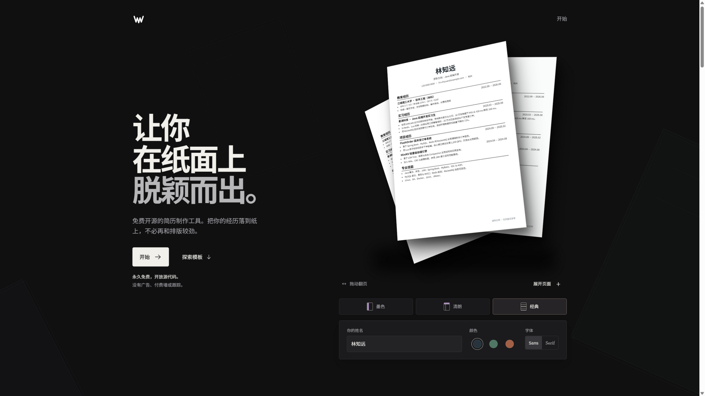

# Weekly Resume

一个面向中文求职者的自部署简历制作工具：选择模板 → 填写内容 → 实时预览 → 导出 PDF。

本项目基于 MIT 许可的开源项目 [Reactive Resume](https://github.com/reactive-resume/reactive-resume) 修改而来（来源与版权说明见 [NOTICE.md](./NOTICE.md)），默认界面为简体中文，并针对中文求职场景调整了模板样例与排版细节。



## 功能概览

**已实现**

- 简历编辑器：左侧模块导航、中间表单、右侧 A4 实时预览，小屏切换编辑/预览
- 15 套模板，内置中文样例简历；模板切换保留全部内容
- PDF 导出（浏览器端生成，文字可复制）、JSON / DOCX 导出
- 导入：Weekly Resume JSON、旧版 Reactive Resume v4 JSON、JSON Resume 标准、PDF / DOCX 解析
- 账号系统：注册登录、邮箱验证、找回密码、两步验证、通行密钥（邮件发送需配置 SMTP）
- 多份简历管理与自动保存
- 求职申请追踪与 ATS 检查
- AI Agent 工作区：对话式修改简历，修改以补丁形式逐条确认后应用（需先在 设置 → 集成 中配置 AI 服务商）
- MCP 服务：外部 AI 客户端可通过 `/mcp` 端点读写简历数据

**实验中 / 计划中**

- 公开分享链接的可撤销管理
- AI 润色的岗位描述对照与评分
- 更多中文模板与移动端编辑优化

以上为当前代码库的实际功能边界；部署后的实际可用性取决于你的运维配置。

## 快速开始（Docker Compose）

前置要求：安装 Docker（含 Docker Compose v2）。

```bash
git clone <你的仓库地址>
cd <仓库目录>

# 按需修改环境变量（至少修改 AUTH_SECRET 与 ENCRYPTION_SECRET）
cp .env.example .env

docker compose up -d --build
```

启动完成后访问 <http://localhost:3000>。Compose 会一并启动 PostgreSQL、Redis 和 SeaweedFS（S3 兼容存储），数据保存在 Docker 卷中。

### 必需的环境变量

| 变量 | 说明 |
| --- | --- |
| `APP_URL` | 对外访问地址，如 `http://localhost:3000` |
| `AUTH_SECRET` | 会话签名密钥，生产环境必须修改为随机长字符串 |
| `ENCRYPTION_SECRET` | AI 服务商密钥等敏感数据的加密密钥，生产环境必须修改 |
| `DATABASE_URL` | PostgreSQL 连接串；Compose 内默认指向 `postgres` 服务 |

完整变量与默认值见 [`.env.example`](./.env.example)。

### 配置邮件（可选）

不配置 SMTP 时应用可以正常使用，验证邮件内容会打印到服务端日志。配置 QQ 邮箱 SMTP 的示例（请填入你自己的授权码，不要提交到仓库）：

```dotenv
SMTP_HOST="smtp.qq.com"
SMTP_PORT="465"
SMTP_USER="your-account@example.com"
SMTP_PASS="你的 SMTP 授权码"
SMTP_FROM="Weekly Resume <your-account@example.com>"
SMTP_SECURE="true"
```

## 本地开发

```bash
# Node.js 24 + pnpm 12
pnpm install
docker compose -f compose.dev.yml up -d postgres redis seaweedfs seaweedfs_create_bucket
pnpm dev
```

常用命令：`pnpm typecheck`、`pnpm test`、`pnpm build`、`pnpm --filter web test`。更多架构与约定见 [AGENTS.md](./AGENTS.md)。

## 部署

生产部署建议：Linux 服务器 + Docker Compose + HTTPS 反向代理。部署前务必：修改全部 `change-me` 占位密钥、为数据库和对象存储配置持久卷与备份、将 `APP_URL` 设为正式域名。详细的阿里云部署文档后续补充。

2 核 2 GiB 的轻量服务器可使用精简编排，移除 SeaweedFS 并限制基础服务内存：

```bash
cp deploy.env.example .env.production
# 编辑 .env.production，至少替换数据库密码及两个随机密钥
docker compose --env-file .env.production -f compose.production.yml up -d --build
```

该编排仅将应用绑定到服务器的 `127.0.0.1:3000`，应通过 SSH 隧道测试，正式上线时再配置 HTTPS 反向代理。生产环境文件 `.env.production` 已被 `.gitignore` 排除，禁止提交。

## 许可证与来源

- 本项目遵循 [MIT License](./LICENSE)；原项目版权声明依法保留。
- 来源与修改说明见 [NOTICE.md](./NOTICE.md)。
- 第三方组件与字体许可见 [apps/web/public/third-party-notices.txt](./apps/web/public/third-party-notices.txt)。
